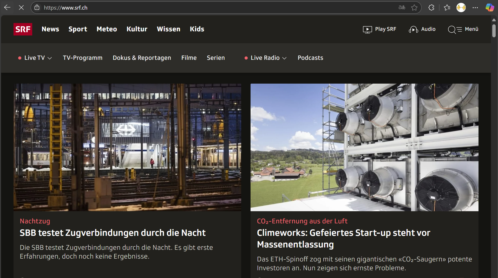
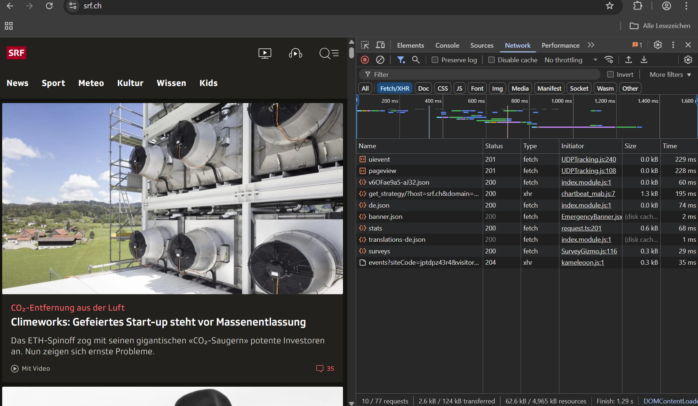

## **Übung 1 -- Developer Tools kennenlernen**

### **Ziel der Übung**

Die Netzwerkaktivitäten einer Webseite analysieren und den Umgang mit dem „Network"-Reiter in den Developer Tools erlernen.

### **Schritte zur Lösung**

1.  **Webseite öffnen**\
    Ich habe die Webseite <https://www.srf.ch> geöffnet.

    

2.  **Developer Tools öffnen (Network-Reiter)**

    - Öffnen über Rechtsklick → **„Untersuchen"**

    - Alternativ über Tastenkombination `F12` oder `Ctrl + Shift + I`

    - Dann auf den **„Network"-Tab** wechseln.

3.  **Beobachtung vor dem Neuladen**

    - Es werden **wenige bis keine Anfragen** angezeigt.

    - Grund: Die Seite wurde bereits geladen und keine neuen Netzwerkaktivitäten fanden statt.

4.  **Seite neu laden** (`F5` oder `Ctrl + R`)

    - Jetzt sehe ich **eine Liste vieler Dateien**, z. B.:

      - `index.html`

      - `main.js`

      - `style.css`

      - verschiedene Bilder, Schriften, etc.

    - Dazu erscheinen Statuscodes wie **200**, **304**, oder **404**.

      

5.  **Liste manuell löschen**

    - Im Network-Reiter oben links auf das **Kreis-mit-Linie-Symbol (⭮)** oder das **„Mülleimer"-Icon** klicken.

    - Die Liste wird geleert.

### **Fazit -- Unterschied zwischen Punkt 3 und 5**

| Punkt | Zustand der Ansicht              | Grund                                                                           |
| ----- | -------------------------------- | ------------------------------------------------------------------------------- |
| **3** | Leere oder veraltete Liste       | Die Seite wurde nicht neu geladen, daher keine neuen Netzwerkaktivitäten        |
| **5** | Volle Liste mit vielen Einträgen | Durch das Neuladen werden alle Dateien und Ressourcen neu geladen und angezeigt |

---

## **Übung 2 -- Inspect Element**

### **Ziel der Übung**

Einzelne Elemente einer Webseite inspizieren und die HTML-Struktur im „Elements"-Reiter untersuchen.

### **Schritte zur Lösung**

1.  **Webseite öffnen**\
    Ich habe die Webseite <https://www.nzz.ch> besucht.

2.  **Element auswählen und Rechtsklick → „Untersuchen"**

    - Ich habe z. B. einen **Artikel-Titel** oder ein **Bild** ausgewählt.

3.  **Bin ich direkt beim richtigen Element gelandet?**

    - **Manchmal ja**, aber nicht immer.

    - Wenn nicht, lag es oft daran, dass ich auf ein übergeordnetes oder verschachteltes Element geklickt habe.

4.  **Wiederholung mit anderen Elementen**

    - Ich habe weitere Elemente ausprobiert, wie Navigation, Texte, Buttons.

    - So habe ich gelernt, wie die HTML-Struktur aufgebaut ist und wie Styles zugeordnet sind.

### **Fazit**

- **Genauer Klick** ist entscheidend, um das richtige Element direkt im HTML zu erwischen.

- Wenn ich daneben klicke, kann ich das gewünschte Element im „Elements"-Tab manuell finden, indem ich den Mauszeiger über andere Elemente bewege.

- So kann ich z. B. CSS-Klassen oder Attribute untersuchen und ändern.
